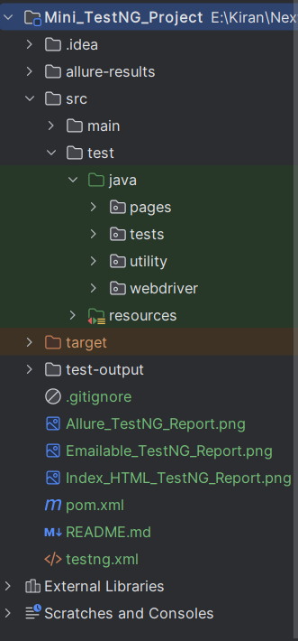
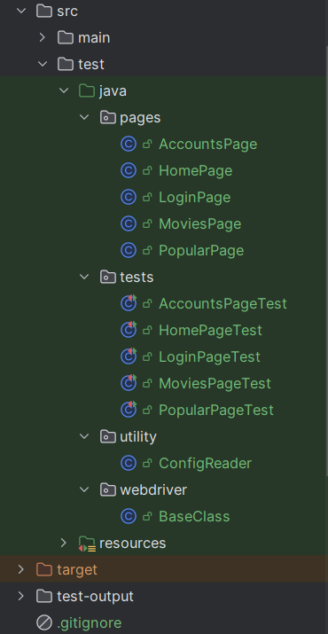
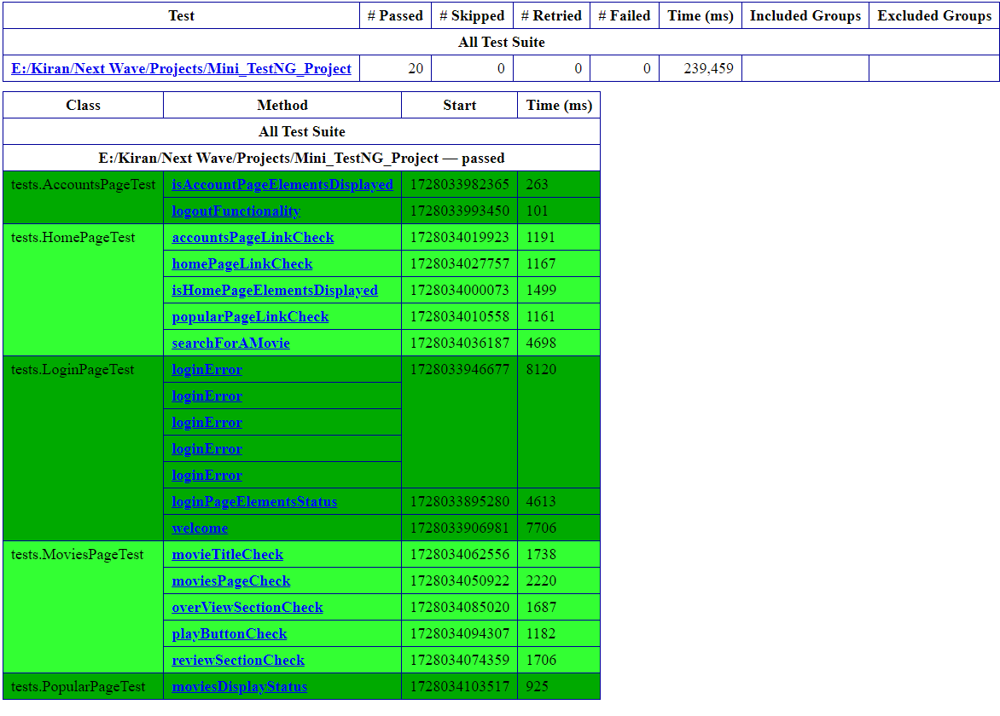
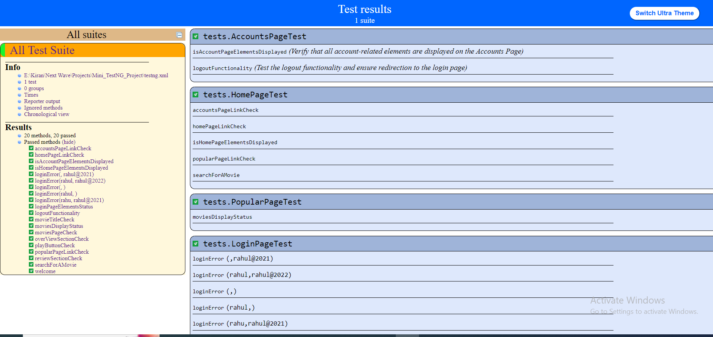
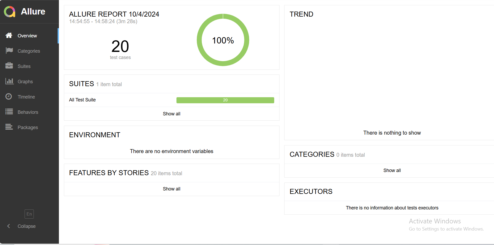

<h1>TestNG Automation Testing Project for Movies App</h1>
<h3>Project Overview: </h3>

This project aims to automate various core features of the QA Movies App, including the login functionality, home page navigation, popular movies page, movies listing, and accounts page using Java, Selenium WebDriver, and TestNG.

<h2>Table of Contents</h2>

1. Project Overview

2. Key Functionalities Automated

3. Folder Structure

4. Installation & Prerequisites

5. Setup Instructions

6. Running the Tests

7. Test Reports & Results 

8. Author Details

<h3>1.  Project Overview: </h3>

The application, accessible at QA Movies App Login, allows users to log in and explore a collection of movies. Automation testing ensures that these functionalities are reliable and work as expected.

<h3>2.  Key Functionalities Automated:</h3>
<h4>Login Functionality:</h4>

After a successful login, the user is redirected to the homepage where their movie list is displayed, validating the core login functionality.

<h4>Homepage Navigation:</h4>

The homepage shows movies related to the user's profile. Automation verifies that the correct movies are displayed upon login.

<h4>Movie Details Page:</h4>

By clicking on a movie, the user is taken to the specific movie's page. Automation checks that the title, description, and other critical information are displayed correctly.

<h4>Popular Movies Page:</h4>

This page lists all popular movies. Automation ensures that the popular movies section loads and displays the expected content.

<h4>Account Page:</h4>

The account page shows the user's account details and plan information. Automation tests that the correct user details are displayed and the page functions as intended.

<h3>3.  Folder Structure</h3>

Here is the folder structure followed for the current project

<h3>4.  Installation & Prerequisites</h3>
* **JDK 1.8+ (Ensure that the Java class path is properly set)**

* **Maven (Ensure that the .m2 class path is properly set)**
* **IntelliJ IDEA**
* **Browser`s (Make sure that you are having Chrome,Firefox & Edge browsers installed in your system)**

**The following dependencies are added in the pom.xml file:**
1. selenium-java (Version: 4.25.0)
2. webdriver-selenium (Version: 0.9.7376)
3. testng (Version: 7.10.0)
4. commons-io (Version: 2.15.0)
5. webdrivermanager (Version: 5.9.2)
6. allure-testng(Version: 2.17.0) 

<h3>5.  Setup Instructions</h3>

1. Clone the repository using the following command:

<h3>https://github.com/kiran-gh/Mini_TestNG_Project</h3>

<h3>6.  Running Tests</h3>

1. Open the project in IntelliJ IDEA.

2. Navigate to testng.xml file using the following path:
"testng.xml" 

3. Right click on testng.xml class file and  select the option: Run 'testng.xml' this will run our project.

<h3>7. Test Reports & Results</h3>

 Report`s will be generated in the following folder: "test-output"

Here are the different reports that are generated after running this project:

1. Emailable-Report.html report: "test-output/emailable-report.html"

2. index.html report: "test-output/index.html"

3. Allure report inside allure folder: allure-results 

 
<h3>8. Author Details:</h3>

**Name:** Vogeti Satya Kiran

**E-Mail:** vogetisatyakiran@gmail.com

**Phone:** 7382482271

**LinkedIn:** <a href="https://www.linkedin.com/in/vogeti-satya-kiran/">You can click here to access my LinkedIn profile:  https://www.linkedin.com/in/vogeti-satya-kiran/ </a> 
